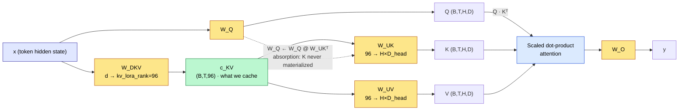
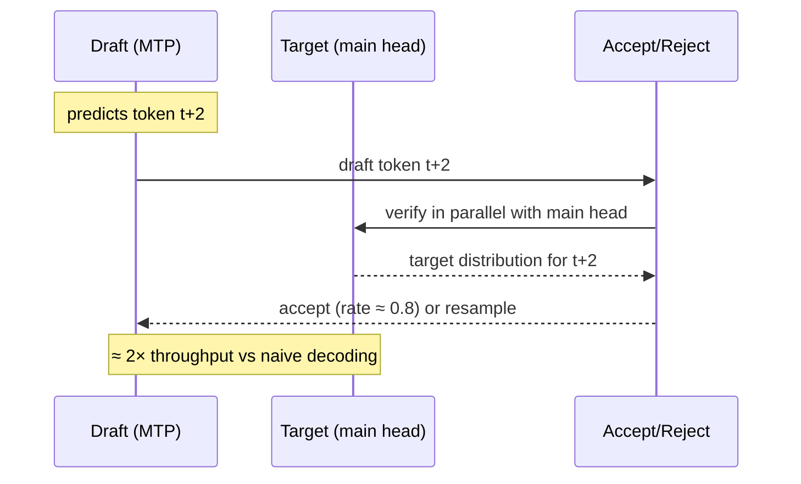

# DeepSeek-V3-Lite

[](https://www.python.org/downloads/)
[](https://pytorch.org/)
[](LICENSE)
[](https://www.nvidia.com/en-us/data-center/a100/)

> **Status:** Architecture, training pipeline, and inference paths are implemented and smoke-tested; the Chinchilla-optimal 8.4B-token pretraining run has not yet started.

> Conceptual notes extracted from the source tree live in [`documentation/`](documentation/README.md); the authoritative MLA deep-dive is [`MLA.md`](MLA.md).

A faithful, from-scratch reimplementation of the DeepSeek-V3 architecture, designed for Chinchilla-optimal training on a single **A100 80GB SXM** (projected **~13-15 hours** wall time).

| Config | Parameters | Tokens | GPU | Wall time | Peak VRAM | Status |
|---|---|---|---|---|---|---|
| `configs/pretrain_a100_422m.yaml` | ~422M | 8.4B | A100 80GB SXM | ~13-15 h | ~35 GB | Code complete |

TF32 forward, `F.scaled_dot_product_attention` (Flash-Attn-2), `torch.compile(mode="max-autotune")`, zero custom CUDA.

---

## Architecture

The model follows the DeepSeek-V3 technical report exactly &mdash; every component implemented end-to-end, no stubs.

### Forward Pass

See the ASCII overview at the end of the Architecture section.

### MLA &mdash; the absorption trick



> Cached K is the **96-dim latent**, not H&times;D. ~5&times; KV-cache reduction vs MHA at inference.

### DeepSeekMoE &mdash; aux-loss-free routing

```
   hidden state h
        │
        ▼
   gate_logit = h · W_gate          (h ∈ ℝ^d, W_gate ∈ ℝ^(d × N_experts))
        │
        ▼
   gate_logit + Bias_b              ← updated from observed token counts
        │                              (aux-loss-free; no gradient on bias)
        ▼
   sigmoid(.)                       scores ∈ (0,1)^N
        │
        ▼
   top-k selection (k=4)            picks 4 routed experts per token
        │
        ├──► routed_expert_1 (SwiGLU)
        ├──► routed_expert_2 (SwiGLU)
        ├──► routed_expert_3 (SwiGLU)
        ├──► routed_expert_4 (SwiGLU)
        ├──► shared_expert_1  (always active, no routing)
        └──► shared_expert_2  (always active, no routing)
                                        │
                                        ▼
                                weighted sum
                                        │
                                        ▼
                                MoE output
```

> No auxiliary loss contaminates the task gradient. The bias is updated
> out-of-band from the observed token count deviation.
```

### MTP &amp; Speculative Decoding



### Text Alternative (ASCII)

```
Input tokens (vocab = 100,018)
    │
    ▼
  Embedding (768-dim)
    │
    ├─ Layers 0-1: Dense Transformer Blocks
    │     MLA (kv_lora_rank=192) → SwiGLU FFN
    │
    ├─ Layers 2-17: MoE Transformer Blocks (×16)
    │     MLA → DeepSeekMoE FFN
    │             ├─ 2 shared experts (always active)
    │             └─ 20 routed experts (top-4 per token)
    │
    └─ RMSNorm → Linear head → logits

  MTP Module (depth = 1) ──────────────────────┘
      Shared output head · predicts token t+2 alongside t+1
```

### Multi-Head Latent Attention (MLA)

MLA projects keys and values into a low-rank latent space (`kv_lora_rank=192`), then recovers full multi-head K and V via up-projection. The **absorption trick** folds the K up-projection into the query weight at inference, so only the compressed latent is cached — a ~5× KV-cache reduction. RoPE is applied to a decoupled 24-dim subspace, keeping the content keys rotation-free.

### DeepSeekMoE

20 routed experts with top-4 routing plus 2 always-active shared experts. Load balancing uses **aux-loss-free bias updates**: a per-expert bias on the gate logit is adjusted periodically based on observed token count deviation, with no auxiliary gradient term contaminating the task loss. The `stacked` dispatch mode runs one bmm per SwiGLU projection.

### Multi-Token Prediction (MTP)

An auxiliary prediction head shares the output embedding and predicts token `t+2` in parallel with the main head. This densifies the training signal and enables single-step speculative decoding at inference.

---

## Training Pipeline

### Pre-training

```bash
bash scripts/launch_a100.sh
```

Configured for **Chinchilla-optimal** training: ~20 tokens per parameter = 8.4B token budget.

- Balanced data mix: `fineweb` (1.0), `smollm` (0.6), `code` (0.3), `cosmo` (0.2), `math` (0.1), `openmath` (0.1)
- 512K micro-steps (128K optimizer steps at grad_accum=4)
- TF32 matmul precision, cuDNN benchmark, `torch.compile(mode="max-autotune")`
- µP LR auto-scaling: reference LR `6e-4` at 757M params → scales to ~8.07e-4 for 422M
- Weight tying: head.weight shares embed.weight storage (saves ~77M params)
- Gradient checkpointing, FP32 AdamW master weights, Safetensors checkpoints
- Automatic pre-flight checks: ≥75 GB VRAM, data validation

### Inference

```python
from models.transformer import Transformer

model = Transformer(cfg).to("cuda")
model.generate(input_ids, max_new_tokens=512, temperature=0.7, top_p=0.9)
```

### Speculative Decoding

The MTP draft head produces a candidate for token `t+2`. If the main model's probability ratio exceeds the acceptance threshold (default 0.8), the draft is accepted — up to 2× throughput in the best case.

```python
from inference.speculative import SpeculativeDecoder

decoder = SpeculativeDecoder(model, mtp_module, acceptance_threshold=0.8)
tokens = decoder.generate(prompt_ids, max_new_tokens=512)
```

---

## Quick Start

```bash
git clone https://github.com/atandra2000/DeepSeek-V3-Lite
cd DeepSeek-V3-Lite
pip install -r requirements.txt
```

### Launch Sequence (A100 80GB)

```bash
# 1. Data — universal 8.0B-token pipeline (shim over LLM/shared_data)
python3 data/prepare_data.py --stage pretrain
# Optional: --skip-download (re-use an existing corpus)
# See data/DATA_PIPELINE.md for the full per-project pipeline guide.

# 2. Microbench — measure peak VRAM
python scripts/microbench_a100.py

# 3. Step-time benchmark — validate MFU
python scripts/step_time_a100.py --steps 20 --warmup 5

# 4. Launch the full run (~13-15 hours)
bash scripts/launch_a100.sh
```

---

## Project Structure

```
├── configs/
│   └── pretrain_a100_422m.yaml     # ~422M Chinchilla config
├── models/
│   ├── transformer.py              # Top-level Transformer + generate()
│   ├── mla.py                      # Multi-Head Latent Attention
│   ├── moe.py                      # AuxLossFreeGate + DeepSeekMoE
│   └── mtp.py                      # MTPBlock, MTPModule, MultiTokenPrediction
├── training/
│   └── pretrain.py                 # Pre-training (TF32, LambdaLR, sharded dataset)
├── inference/
│   ├── generate.py                 # Interactive generation entry point
│   └── speculative.py              # MTP speculative decoding
├── utils/
│   ├── checkpoint.py               # Atomic safetensors checkpoint manager
│   ├── distributed.py              # Single-GPU device helper
│   ├── logging.py                  # WandB-capable training logger
│   └── memory.py                   # VRAM estimator + GPU guard
├── data/
│   ├── prepare_data.py             # Shim over data/shared_data/ universal pipeline
│   ├── shared_data/                # Vendored universal 8.0B-token pipeline
│   └── DATA_PIPELINE.md            # Per-project pipeline guide
└── scripts/
    ├── microbench_a100.py          # Peak VRAM measurement
    ├── step_time_a100.py           # MFU benchmark (target 30-45%)
    └── launch_a100.sh              # Full run launcher
```

---

## Configuration

```yaml
# configs/pretrain_a100_422m.yaml
model:
  vocab_size:          100018
  dim:                 768
  n_layers:            18           # 2 dense + 16 MoE
  n_heads:             12
  n_routed_experts:    20
  n_shared_experts:    2
  n_activated_experts: 4
  kv_lora_rank:        192
  qk_rope_head_dim:    24
  v_head_dim:          96
  max_seq_len:         2048
  attn_impl:           "sdpa"
  use_grouped:         "stacked"
  weight_tying:        true

training:
  micro_batch_size:              8
  gradient_accumulation_steps:   4
  total_steps:                   512000
  lr:                            5.0e-4    # µP-scaled to ~8.07e-4
  mup_lr:                        true
```

**~422M params** (embedding: 76.8M, non-embedding: ~345M). Chinchilla-optimal at 8.4B tokens (20:1 ratio).

---

## Design Decisions

| Decision | Rationale |
|---|---|
| 422M scale on A100 80GB | Chinchilla-optimal data fits in 13-15 h at 35-40% MFU |
| MLA over GQA | 5× KV-cache reduction; absorption trick removes key expansion at decode |
| Aux-loss-free MoE balancing | Bias updates don't contaminate task loss gradient |
| 20 routed experts, 4 active | 20% sparsity — close to DeepSeek-V3 design ratio (12.5-25%) |
| SDPA over einsum | Flash-Attn-2 on CUDA; zero custom CUDA dependencies |
| TF32 on A100 | Native Tensor Core speed; no FP8 hardware required |
| seq_len=2048 | More optimizer steps per token budget (128K vs ~64K at 4096) |
| grad_accum=4 | Smoother gradient estimates at 65K tok/opt-step |
| Weight tying | head.weight shares embed.weight — saves ~77M params |
| Stacked MoE forward | One Python trip per layer, not per expert |
| Gradient checkpointing | ~3× activation reduction at 33% extra backward FLOPs |
| µp-LR scaling | One LR reference works across model scales |

---

## References

- [DeepSeek-V3 Technical Report](https://arxiv.org/abs/2412.19437) — architecture, MLA, MoE
- [Chinchilla Scaling Laws](https://arxiv.org/abs/2203.15556) — 20 tokens/param rule
- [DeepSeekMoE](https://arxiv.org/abs/2401.06066) — fine-grained expert decomposition
- [Multi-Token Prediction](https://arxiv.org/abs/2404.19737) — auxiliary prediction heads
- [µP (Maximal Update Parameterization)](https://arxiv.org/abs/2203.03466) — hyperparameter transfer across scales
