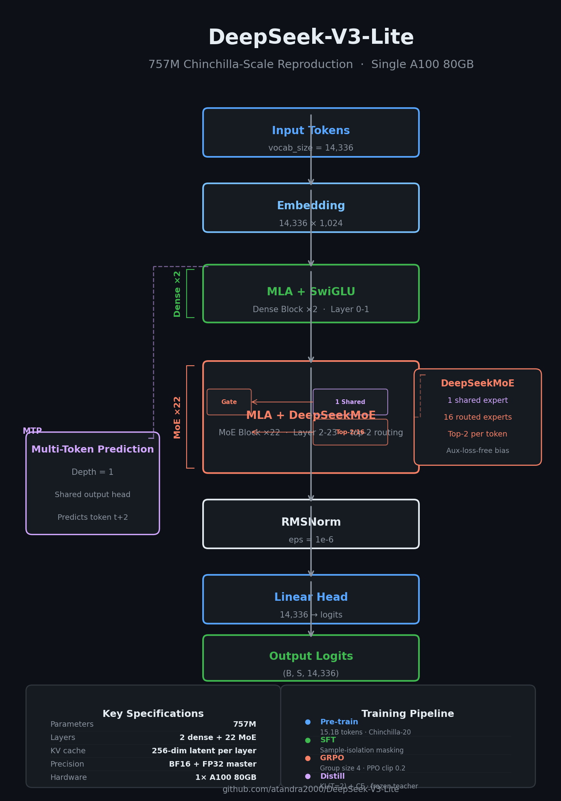

# DeepSeek-V3-Lite

A faithful, from-scratch reimplementation of the DeepSeek-V3 architecture, scaled down to **82M parameters** for single-GPU training on an **RTX 4090 24 GB** in **~7 hours**.

| Config | Parameters | Tokens | Wall time (RTX 4090) | Peak VRAM | Status |
|---|---|---|---|---|---|
| `configs/pretrain_82m.yaml` | 82.1M | 1.18B | ~7 h | ~3.4 GB | Code complete, pre-training pending |

BF16 forward, `F.scaled_dot_product_attention` (Flash-Attn-2), `torch.compile`, zero custom CUDA.

---



## Architecture

The model follows the DeepSeek-V3 technical report exactly — every component is implemented end-to-end, no stubs.

```
Input tokens (vocab = 14,336)
    │
    ▼
  Embedding (14,336 × 640)
    │
    ├─ Layers 0–1: Dense Transformer Blocks
    │     MLA → SwiGLU FFN
    │
    ├─ Layers 2–11: MoE Transformer Blocks (×10)
    │     MLA → DeepSeekMoE FFN
    │             ├─ 1 shared expert (always active)
    │             └─ 8 routed experts (top-2 per token)
    │
    └─ RMSNorm → Linear head → logits

  MTP Module (depth = 1) ──────────────────────┘
      Shared output head · predicts token t+2 alongside t+1
```

### Multi-Head Latent Attention (MLA)

MLA projects keys and values into a low-rank latent space (`kv_lora_rank=128`), then recovers full multi-head K and V via up-projection. The **absorption trick** folds the K up-projection into the query weight at inference, so only the compressed latent is cached — a ~5× KV-cache reduction. RoPE is applied to a decoupled 16-dim subspace, keeping the content keys rotation-free.

### DeepSeekMoE

8 routed experts with top-2 routing plus 1 always-active shared expert. Load balancing uses **aux-loss-free bias updates**: a per-expert bias on the gate logit is adjusted periodically based on observed token count deviation, with no auxiliary gradient term contaminating the task loss. The `stacked` dispatch mode runs one bmm per SwiGLU projection.

### Multi-Token Prediction (MTP)

An auxiliary prediction head shares the output embedding and predicts token `t+2` in parallel with the main head. This densifies the training signal and enables single-step speculative decoding at inference.

---

## Training Pipeline

### Pre-training

```bash
python training/pretrain.py --config configs/pretrain_82m.yaml
```

- Code-focused data mix: `code` (1.5×), `fineweb` (1.0×), `math` (0.2×) — ~1.18B tokens
- 600-step warmup → cosine decay over 36,000 steps
- BF16 forward, FP32 AdamW master weights
- **Weight tying** enabled: head.weight shares embed.weight storage (saves ~9M params)
- µP LR auto-scaling: `6e-4 × √(757M / 82M) ≈ 1.82e-3`
- Gradient checkpointing by default (~3× activation memory reduction)
- `torch.compile(mode="reduce-overhead")`
- Safetensors checkpoints with atomic temp-rename

### Inference

```python
from models.transformer import Transformer

model = Transformer(cfg).to("cuda")
model.generate(input_ids, max_new_tokens=512, temperature=0.7, top_p=0.9)
```

### Speculative Decoding

The MTP draft head produces a candidate for token `t+2`. If the main model's probability ratio exceeds the acceptance threshold (default 0.8), the draft is accepted — up to 2× throughput in the best case.

```python
from inference.speculative import SpeculativeDecoder

decoder = SpeculativeDecoder(model, mtp_module, acceptance_threshold=0.8)
tokens = decoder.generate(prompt_ids, max_new_tokens=512)
```

---

## Quick Start

```bash
git clone https://github.com/atandra2000/DeepSeek-V3-Lite
cd DeepSeek-V3-Lite
pip install -r requirements.txt
```

### Launch Sequence (RTX 4090)

```bash
# 1. Data — download and tokenise ~1.2B tokens
python data/prepare_data.py --stage pretrain \
    --tokenizer deepseek-ai/deepseek-coder-v2-lite \
    --shard-size-tokens 50000000 --max-tokens 1176000000 \
    --data-mix code-82m --output-dir data/pretrain_code-82m

# 2. Microbench — measure peak VRAM
python scripts/microbench_82m.py

# 3. Step-time benchmark — validate MFU
python scripts/step_time_82m.py --steps 10 --warmup 3

# 4. Launch the full run (~7 hours)
bash scripts/launch_82m.sh
```

---

## Project Structure

```
├── configs/
│   └── pretrain_82m.yaml         # 82M model + training schedule
├── models/
│   ├── transformer.py            # Top-level Transformer + generate()
│   ├── mla.py                    # Multi-Head Latent Attention
│   ├── moe.py                    # AuxLossFreeGate + DeepSeekMoE
│   └── mtp.py                    # MTPBlock, MTPModule, MultiTokenPrediction
├── training/
│   └── pretrain.py               # Pre-training (BF16, LambdaLR, sharded dataset)
├── inference/
│   ├── generate.py               # Autoregressive generation
│   └── speculative.py            # MTP speculative decoding
├── utils/
│   ├── checkpoint.py             # Atomic safetensors checkpoint manager
│   ├── distributed.py            # Single-GPU device helper
│   ├── logging.py                # WandB-capable training logger
│   └── memory.py                 # VRAM estimator + GPU guard
├── data/
│   └── prepare_data.py           # Download, tokenise, pack datasets
└── scripts/
    ├── microbench_82m.py         # Peak VRAM measurement
    ├── step_time_82m.py          # MFU benchmark
    └── launch_82m.sh             # Full run launcher
```

---

## Configuration

```yaml
# configs/pretrain_82m.yaml — key model hyperparameters
model:
  vocab_size:          14336
  dim:                 640
  n_layers:            12           # 2 dense + 10 MoE
  n_heads:             10
  n_routed_experts:    8
  n_shared_experts:    1
  n_activated_experts: 2
  kv_lora_rank:        128
  qk_rope_head_dim:    16
  v_head_dim:          64
  max_seq_len:         1024
  attn_impl:           "sdpa"
  use_grouped:         "stacked"
  weight_tying:        true

training:
  micro_batch_size:              8
  gradient_accumulation_steps:   4
  total_steps:                   36000
  lr:                            8.0e-4    # µP-scaled to 1.82e-3
  mup_lr:                        true
```

**Parameter count: 82,111,616** (`~82M`). Non-embedding: 72.9M. Sub-Chinchilla at 1.18B tokens — optimised for the ~7 h RTX 4090 budget.

---

## Design Decisions

| Decision | Rationale |
|---|---|
| 82M scale (not 757M or 671B) | Fits RTX 4090 24 GB in a few hours; authentic architecture |
| MLA over GQA | 5× KV-cache reduction; absorption trick removes key expansion at decode |
| Aux-loss-free MoE balancing | Bias updates don't contaminate task loss gradient |
| SDPA over einsum | Flash-Attn-2 on CUDA; zero custom CUDA dependencies |
| BF16 + torch.compile | Tensor cores; no FP8 hardware required |
| Weight tying | head.weight shares embed.weight storage — saves ~9M params |
| Stacked MoE forward | One Python trip per layer, not per expert |
| Decoupled RoPE | 16-dim rotation preserves low-rank KV compression accuracy |
| Gradient checkpointing | ~3× activation reduction at 33% extra backward FLOPs |
| Code-heavy data mix | Maximises code-generation quality within the token budget |

---

## References

- [DeepSeek-V3 Technical Report](https://arxiv.org/abs/2412.19437) — architecture, MLA, MoE
- [Chinchilla Scaling Laws](https://arxiv.org/abs/2203.15556) — 20 tokens/param rule
- [DeepSeekMoE](https://arxiv.org/abs/2401.06066) — fine-grained expert decomposition
- [DeepSeek-R1](https://arxiv.org/abs/2501.12948) — GRPO + reasoning distillation
- [Multi-Token Prediction](https://arxiv.org/abs/2404.19737) — auxiliary prediction heads
- [YaRN](https://arxiv.org/abs/2309.00071) — efficient RoPE extension
