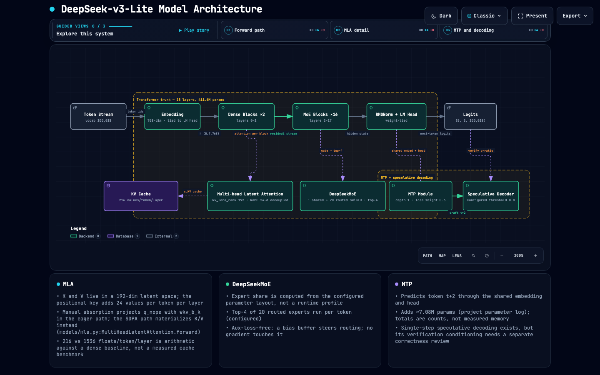

# DeepSeek-v3-Lite — Project Overview

[](https://www.python.org/downloads/)
[](https://pytorch.org/)
[](LICENSE)
[](https://www.nvidia.com/en-us/data-center/a100/)

> **Status:** Architecture (MLA, DeepSeekMoE, MTP, aux-loss-free balancing, μP LR scaling, atomic safetensors checkpointing) is **implemented and CPU smoke-tested**. A full single-GPU pre-training run has **not yet been executed** (`checkpoints/` is empty). **FP8 mixed precision and DualPipe pipeline parallelism are paper-spec only — no FP8/DualPipe code is in this repo**; training runs in **BF16 on a single GPU**.

> **Documentation site:** [atandra2000.github.io/DeepSeek-v3-Lite](https://atandra2000.github.io/DeepSeek-v3-Lite/) — full HTML portal with concepts, API references, and guides. Markdown sources live in [`docs/`](docs/README.md); every code-symbol citation is machine-verified by `tests/test_doc_refs.py`.

A faithful, from-scratch reimplementation of the DeepSeek-V3 architecture, designed for Chinchilla-optimal training on a single **A100 80GB SXM** (projected **~30-45 hours** wall time — unverified estimate).

| Config | Parameters | Tokens | GPU | Wall time | Peak VRAM | Status |
|---|---|---|---|---|---|---|
| `configs/pretrain_a100_422m.yaml` | ~412M | 8.4B | A100 80GB SXM | ~30-45 h (est.) | ~35 GB | Code complete |
| `configs/pretrain_1650_2m.yaml` | ~2M | 50K vocab (GPT-2) | GTX 1650 4GB | minutes | <1 GB | Smoke-test config — see [docs/README.md](docs/README.md#configs) |

Two configurations ship in `configs/`:

- **`pretrain_a100_422m.yaml`** — the canonical Chinchilla-optimal
  recipe for a single A100 80GB SXM. Full MLA + MoE + MTP. The target end-to-end run described throughout the README and the rest of the docs.
- **`pretrain_1650_2m.yaml`** — a ~2M-param tiny config for the
  **GTX 1650 4GB** end-to-end smoke test. Same architecture features (MLA, MoE aux-loss-free, MTP) scaled down to fit 4 GB: `dim=64, n_layers=4 (2 dense + 2 MoE × 4 experts)`, GPT-2 vocab (avoids HuggingFace auth for the deepseek-coder tokenizer). All MLA / MoE / MTP invariants are preserved. Useful for verifying the full training loop, Triton kernel paths (gated on CUDA), and inference on hardware too small for the real run. Used by `tests/conftest.py::small_cfg` and the 1650 smoke test suite.

TF32 forward, `F.scaled_dot_product_attention` (Flash-Attn-2), `torch.compile(mode="max-autotune")`, zero custom CUDA.

---

## 🗺️ Visual Architecture Atlas

> Explore the full **[Interactive Visual Systems Guide](docs/diagrams/deepseek_visual_guide.html)** featuring verified Archify maps, live KV-cache compression calculators, dynamic bias balancing simulations, and [verification receipts](docs/diagrams/RECEIPTS.md).

<div align="center">
  <a href="docs/diagrams/deepseek_visual_guide.html">
    
  </a>
  <p><em>Figure 1: DeepSeek-v3-Lite Full Architecture Map — Multi-Head Latent Attention (MLA) with low-rank KV compression ($d_c=192$), decoupled RoPE, and DeepSeekMoE fine-grained routed experts. Click image to open interactive guide.</em></p>
</div>

### Interactive Architecture & Systems Diagrams

| Diagram | Description | Interactive HTML | Visual Preview |
|---|---|:---:|:---:|
| **Model Architecture** | Full 18-layer topology (2 dense + 16 MoE), MLA KV compression, decoupled RoPE, SwiGLU, and MTP depth-1 head | [Open Map ↗](docs/diagrams/architecture-model.html) | [PNG](docs/diagrams/architecture-model.visual-check.1440x900.dark.png) |
| **Optimizations & Memory** | A100 VRAM layout (35 GB peak), fused Triton MLA kernels, grouped-GEMM MoE dispatch, atomic safetensors, and μP LR scaling | [Open Map ↗](docs/diagrams/architecture-optimizations.html) | [PNG](docs/diagrams/architecture-optimizations.visual-check.1440x900.dark.png) |
| **Data Pipeline** | 8.4B Chinchilla-optimal token stream, DeepSeek-Coder tokenizer, binary chunk sharding, and memory-mapped `PretrainDataset` | [Open Map ↗](docs/diagrams/dataflow-data-pipeline.html) | [PNG](docs/diagrams/dataflow-data-pipeline.visual-check.1440x900.dark.png) |
| **Training Workflow** | Pretrain loop, AdamW optimizer with cosine schedule, auxiliary-loss-free dynamic bias load balancer, and MTP auxiliary loss | [Open Map ↗](docs/diagrams/workflow-training-loop.html) | [PNG](docs/diagrams/workflow-training-loop.visual-check.1440x900.dark.png) |

---

## Architecture

The model follows the DeepSeek-V3 technical report exactly &mdash; every component implemented end-to-end, no stubs.

### Forward Pass

See the ASCII overview at the end of the Architecture section.

### MLA &mdash; the absorption trick

```
    ┌───────────────────────────────────┐
    │x (token hidden state)             │
    └────────┬───────────────────┬──────┘
             │                   │
             ▼                   ▼
     ┌───────────────┐   ┌───────────────┐
     │W_DKV          │   │W_Q            │
     │d → 96         │   └───────┬───────┘
     └───────┬───────┘           │
             │                   │
             ▼                   ▼
  ┌─────────────────────┐┌───────────────┐
  │c_KV (B,T,96)        ││Q (B,T,H,D)    │
  │what we cache        │└───────┬───────┘
  └──────┬───────────┬──┘        │
         │           │           │
         ▼           ▼           │
   ┌───────────┐ ┌───────────┐   │
   │W_UK       │ │W_UV       │   │
   │96→H×D     │ │96→H×D     │   │
   └─────┬─────┘ └───┬───────┘   │
         │           │           │
         ▼           ▼           │
  ┌─────────────┐┌─────────────┐ │
  │K (B,T,H,D)  ││V (B,T,H,D)  │ │
  └──────┬──────┘└───┬─────────┘ │
         │           │           │
         └───────────┴───────────┴
                     │           │
                     │           │
                     │           │
                     │           │
                     │           │
                     │           │
                     │           │
                     │           │
                     │           │
                                 │
                     └───────────┴
                                 │
                  ┌────────────────────────────┐
                  │Q·Kᵀ scaled                 │
                  │dot-product attention       │
                  └──────────────┬─────────────┘
                                 │
                                 │
                                 ▼
                         ┌───────────────┐
                         │W_O            │
                         └───────┬───────┘
                                 │
                         ┌───────────────┐
                         │y              │
                         └───────────────┘
  W_Q ──(absorption)──► W_UK:  W_Q ← W_Q @ W_UKᵀ — K is never materialized;
  what is cached is the 96-dim c_KV.
```

> Cached K is the **96-dim latent**, not H&times;D. ~5&times; KV-cache reduction vs MHA at inference.

### DeepSeekMoE &mdash; aux-loss-free routing

```
   hidden state h
        │
        ▼
   gate_logit = h · W_gate          (h ∈ ℝ^d, W_gate ∈ ℝ^(d × N_experts))
        │
        ▼
   gate_logit + Bias_b              ← updated from observed token counts
        │                              (aux-loss-free; no gradient on bias)
        ▼
   sigmoid(.)                       scores ∈ (0,1)^N
        │
        ▼
   top-k selection (k=4)            picks 4 routed experts per token
        │
        ├──► routed_expert_1 (SwiGLU)
        ├──► routed_expert_2 (SwiGLU)
        ├──► routed_expert_3 (SwiGLU)
        ├──► routed_expert_4 (SwiGLU)
        └──► shared_expert   (always active, no routing)
                                        │
                                        ▼
                                weighted sum
                                        │
                                        ▼
                                MoE output
```

> No auxiliary loss contaminates the task gradient. The bias is updated out-of-band from the observed token count deviation.

### MTP &amp; Speculative Decoding

```
Draft (MTP)           Accept/Reject                   Target (main head)
predicts token t+2          │                               │
│ ① draft token t+2         │                               │
│ ──────────────────────►   │                               │
│                           │ ② verify in parallel          │
│                           │ ──────────────────────────►   │
│                           │                               │
│                           │ ◄─③ target distribution────   │
│   ④ accept / resample (≈0.8)                              │
│ ◄──────────────────────   │                               │
≈ 2× throughput vs naive decoding
```

### Text Alternative (ASCII)

```
Input tokens (vocab = 100,018)
    │
    ▼
  Embedding (768-dim)
    │
    ├─ Layers 0-1: Dense Transformer Blocks
    │     MLA (kv_lora_rank=192) → SwiGLU FFN
    │
    ├─ Layers 2-17: MoE Transformer Blocks (×16)
    │     MLA → DeepSeekMoE FFN
    │             ├─ 1 shared expert (always active)
    │             └─ 20 routed experts (top-4 per token)
    │
    └─ RMSNorm → Linear head → logits

  MTP Module (depth = 1) ──────────────────────┘
      Shared output head · predicts token t+2 alongside t+1
```

### Multi-Head Latent Attention (MLA)

MLA projects keys and values into a low-rank latent space (`kv_lora_rank=192`), then recovers full multi-head K and V via up-projection. The **absorption trick** folds the K up-projection into the query weight at inference, so only the compressed latent is cached — a ~7× KV-cache reduction (216 vs 1536 floats/token/layer). RoPE is applied to a decoupled 24-dim subspace, keeping the content keys rotation-free.

### DeepSeekMoE

20 routed experts with top-4 routing plus 1 always-active shared expert. Load balancing uses **aux-loss-free bias updates**: a per-expert bias on the gate logit is adjusted periodically based on observed token count deviation, with no auxiliary gradient term contaminating the task loss. The `stacked` dispatch mode runs one bmm per SwiGLU projection.

### Multi-Token Prediction (MTP)

An auxiliary prediction head shares the output embedding and predicts token `t+2` in parallel with the main head. This densifies the training signal and enables single-step speculative decoding at inference.

---

## Training Pipeline

### Pre-training

```bash
bash scripts/launch_a100.sh
```

Configured for **Chinchilla-optimal** training: ~20 tokens per parameter = 8.4B token budget.

- Balanced data mix: `fineweb` (1.0), `smollm` (0.6), `code` (0.3), `cosmo` (0.2), `math` (0.1), `openmath` (0.1)
- 512K micro-steps (128K optimizer steps at grad_accum=4)
- TF32 matmul precision, cuDNN benchmark, `torch.compile(mode="max-autotune")`
- µP LR auto-scaling: reference LR `6e-4` at 757M params → ~8.07e-4 (418.7M with MTP; 8.14e-4 for the 411.6M base)
- Weight tying: head.weight shares embed.weight storage (saves ~77M params)
- Gradient checkpointing, FP32 AdamW master weights, Safetensors checkpoints
- Automatic pre-flight checks: ≥75 GB VRAM, data validation

### Inference

```python
from models.transformer import Transformer

model = Transformer(cfg).to("cuda")
model.generate(input_ids, max_new_tokens=512, temperature=0.7, top_p=0.9)
```

### Speculative Decoding

The MTP draft head produces a candidate for token `t+2`. If the main model's probability ratio exceeds the acceptance threshold (default 0.8), the draft is accepted — up to 2× throughput in the best case.

```python
from inference.speculative import SpeculativeDecoder

decoder = SpeculativeDecoder(model, mtp_module, acceptance_threshold=0.8)
tokens = decoder.generate(prompt_ids, max_new_tokens=512)
```

---

## Quick Start

```bash
# 0. Get the data pipeline (this project imports the universal pipeline from
#    a sibling directory — `data/prepare_data.py` adds it to sys.path):
#    LLM/                       ← workspace root
#      ├── shared_data/         ← universal 8.0B-token pipeline (single source of truth)
#      ├── DeepSeek-v3-Lite/    ← this project
#      ├── ...
#    Pull or vendor the LLM/shared_data/ directory; otherwise the data step below
#    will fail with `ModuleNotFoundError: No module named 'shared_data'`.
git clone https://github.com/atandra2000/DeepSeek-V3-Lite
cd DeepSeek-V3-Lite
pip install -r requirements.txt
```

### Launch Sequence (A100 80GB)

See **[Getting Started](docs/guides/getting-started.md)** for quickstart and **[Operations, Testing & Triton Kernels](docs/concepts/kernels-and-ops.md)** for the launch sequence: CPU tests → GPU microbench → data prep → `launch_a100.sh`.

```bash
python -m pytest tests/ -q                    # CPU correctness
python scripts/microbench_a100.py             # VRAM headroom (CUDA)
python3 data/prepare_data.py --stage pretrain # once
bash scripts/launch_a100.sh                   # ~30–45 h on A100 80GB (estimated)
```

---

## Documentation

| Doc | Covers |
|---|---|
| [docs/README.md](docs/README.md) | Navigation map + quick reference |
| [Getting Started](docs/guides/getting-started.md) | Installation, smoke tests, first run |
| [Foundations & Architecture](docs/concepts/foundations.md) | DeepSeek lineage, primitives, full topology, parameter budget, portfolio comparison |
| [MLA & Mixed Precision](docs/concepts/attention-and-precision.md) | Low-rank KV compression, absorption, decoupled RoPE; FP8 (paper-spec) |
| [DeepSeekMoE & MTP](docs/concepts/moe-mtp.md) | Aux-loss-free routing, shared experts; multi-token prediction, speculative decoding |
| [DualPipe Parallelism](docs/concepts/parallelism.md) | Bidirectional pipeline parallelism — paper-spec, not implemented |
| [Data Pipeline](docs/concepts/data-pipeline.md) | Shared 8.0B-token pipeline, tokenizer, shard format |
| [Operations, Testing & Triton Kernels](docs/concepts/kernels-and-ops.md) | Test suite, checkpoints, VRAM budget; fused MLA/MoE kernels |
| [Training Pipeline](docs/training.md) | Loop, AdamW, μP LR, NaN guard, checkpointing, YAML reference |
| [Inference & Serving](docs/inference.md) | Sampling, KV cache, speculative decoding |
| [References R1–R9](docs/references/R1_config_schema.md) | Symbol-anchored API reference for config, model, training, utils, inference |
| [Guides G1–G5](docs/guides/G1_debugging_playbook.md) | Debugging, μP/LR tuning, Triton development, benchmarking, checkpoint ops |
| [Contributing](docs/guides/contributing.md) | Doc contract, gates, test & code conventions |

---

## Project Structure

```
├── configs/
│   └── pretrain_a100_422m.yaml     # ~422M Chinchilla config
├── models/
│   ├── transformer.py              # Top-level Transformer + generate()
│   ├── mla.py                      # Multi-Head Latent Attention
│   ├── moe.py                      # AuxLossFreeGate + DeepSeekMoE
│   └── mtp.py                      # MTPBlock, MTPModule, MultiTokenPrediction
├── training/
│   └── pretrain.py                 # Pre-training (TF32, LambdaLR, sharded dataset)
├── inference/
│   ├── generate.py                 # Interactive generation entry point
│   └── speculative.py              # MTP speculative decoding
├── utils/
│   ├── checkpoint.py               # Atomic safetensors checkpoint manager
│   ├── logging.py                  # WandB-capable training logger
│   └── memory.py                   # VRAM estimator + GPU guard
├── data/
│   └── prepare_data.py             # Shim — imports universal pipeline from sibling LLM/shared_data
└── scripts/
    ├── microbench_a100.py          # Peak VRAM measurement
    ├── step_time_a100.py           # MFU benchmark (target 30-45%)
    └── launch_a100.sh              # Full run launcher
```

---

## Configuration

```yaml
# configs/pretrain_a100_422m.yaml — abbreviated; full file in configs/.
model:
  vocab_size:          100018
  dim:                 768
  n_layers:            18           # 2 dense + 16 MoE
  n_heads:             12
  n_dense_layers:      2
  n_routed_experts:    20
  n_shared_experts:    1            # load-bearing: tied to AuxLossFreeGate architecture
  n_activated_experts: 4
  inter_dim:           1536
  moe_inter_dim:       384
  kv_lora_rank:        192
  q_lora_rank:         0
  qk_nope_head_dim:    48
  qk_rope_head_dim:    24
  v_head_dim:          64
  max_seq_len:         2048
  rope_theta:          10000
  rope_factor:         1.0          # YaRN not enabled at training length
  mscale:              1.0
  mtp_depth:           1
  mtp_loss_weight:     0.3
  dtype:               bf16
  attn_impl:           "sdpa"
  moe_dispatch:         "stacked"
  weight_tying:        true

training:
  micro_batch_size:              8
  gradient_accumulation_steps:   4
  total_steps:                   512000
  warmup_steps:                  2000
  lr:                            8.0e-4    # µP-scaled from 6e-4 @ 757M
  min_lr_ratio:                  0.05
  weight_decay:                  0.1
  beta1:                         0.9
  beta2:                         0.95
  grad_clip:                     1.0
  grad_checkpoint:               true
  compile:                       true
  save_interval:                 4000
  log_interval:                  50
  mup_lr:                        true
  mup_lr_reference:              6.0e-4
  mup_lr_reference_params:       757226496
  nan_guard:                     true
  nan_guard_max_consecutive:     5
  bias_update_speed:             0.001
  bias_update_every:             1
  save_dir:                      "checkpoints/pretrain_a100"

data:
  train_data_path:      "data/pretrain_chinchilla"
  tokenizer_path:       "deepseek-ai/deepseek-coder-v2-lite"
```

**~412M params** (embedding: 76.8M, non-embedding: ~335M). Chinchilla-optimal at 8.4B tokens (20:1 ratio).

---

## Design Decisions

| Decision | Rationale |
|---|---|
| ~412M scale on A100 80GB | Chinchilla-optimal data fits in ~30-45 h at 35-40% MFU (est.) |
| MLA over GQA | 5× KV-cache reduction; absorption trick removes key expansion at decode |
| Aux-loss-free MoE balancing | Bias updates don't contaminate task loss gradient |
| 20 routed experts, 4 active | 20% sparsity — close to DeepSeek-V3 design ratio (12.5-25%) |
| SDPA over einsum | Flash-Attn-2 on CUDA; zero custom CUDA dependencies |
| TF32 on A100 | Native Tensor Core speed; no FP8 hardware required |
| seq_len=2048 | More optimizer steps per token budget (128K vs ~64K at 4096) |
| grad_accum=4 | Smoother gradient estimates at 65K tok/opt-step |
| Weight tying | head.weight shares embed.weight — saves ~77M params |
| Stacked MoE forward | One Python trip per layer, not per expert |
| Gradient checkpointing | ~3× activation reduction at 33% extra backward FLOPs |
| µp-LR scaling | One LR reference works across model scales |

---

## References

- [DeepSeek-V3 Technical Report](https://arxiv.org/abs/2412.19437) — architecture, MLA, MoE
- [Chinchilla Scaling Laws](https://arxiv.org/abs/2203.15556) — 20 tokens/param rule
- [DeepSeekMoE](https://arxiv.org/abs/2401.06066) — fine-grained expert decomposition
- [Multi-Token Prediction](https://arxiv.org/abs/2404.19737) — auxiliary prediction heads
- [µP (Maximal Update Parameterization)](https://arxiv.org/abs/2203.03466) — hyperparameter transfer across scales
